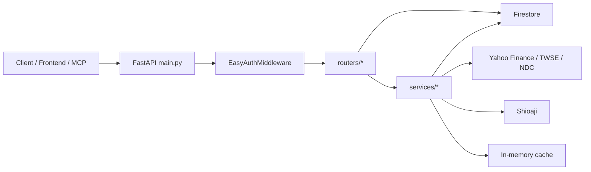
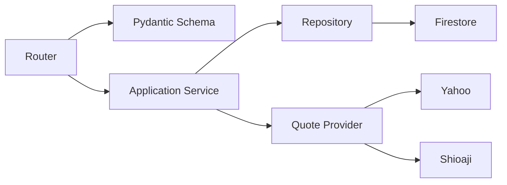

# Back-End/python-backend Code Review 與優化建議

Review date: 2026-05-23  
Scope: `Back-End/python-backend`  
Focus: 系統結構、效能優化、可導入設計模式、測試與部署風險

## 1. Executive Summary

`python-backend` 是一個 FastAPI 後端，主要負責投資資產管理、報價查詢、快照、標籤風險、MCP 工具與系統狀態查詢。整體已具備清楚的 router/service 分層雛形，也已有快取、Circuit Breaker、Shioaji/Yahoo fallback 等重要韌性設計。

目前最大的風險不在單一 endpoint，而在「架構邊界尚未完全穩定」：

- Router 直接操作 Firestore 與外部 API，造成測試、效能與錯誤處理耦合。
- Auth bypass 環境變數不一致，導致大部分測試無法真正測到業務邏輯。
- MCP endpoint 在特定環境設定缺失時可能變成未授權資料入口。
- 多個 collection root endpoint 對 trailing slash 行為不一致，會產生 `307 Temporary Redirect`。
- Firestore 初始化缺少測試替身或 emulator path，導致 local/CI 容易讀取 `./serviceAccountKey.json` 失敗。

建議短期先修正測試與安全邊界，再逐步把資料存取、外部報價、快取、schema 驗證抽成可替換的介面。中長期可採用 Repository、Service Layer、Provider Strategy、Unit of Work、DTO/Schema、Dependency Injection 等模式，讓後端更容易測試、擴充與觀測。

## 2. 專案現況概覽

目前結構大致如下：

```text
python-backend/
  main.py
  routers/
    holdings.py
    watchlist.py
    transactions.py
    assets.py
    plans.py
    tags.py
    market_state.py
    correlation.py
    market.py
    stocks.py
    snapshots.py
    settings.py
    preferences.py
    asset_tags.py
    system.py
    mcp.py
  services/
    firestore.py
    yahoo_finance.py
    shioaji_manager.py
    api_switch.py
    cache.py
    snapshot_service.py
    tag_risk_service.py
    rate_helper.py
    mcp_service.py
  utils/
    market_hours.py
  tests/
```

目前請求流程可概括為：



比較需要改善的是：`Router -> Firestore` 與 `Router -> 外部 API` 的直接依賴太多。這讓 router 同時承擔 HTTP、驗證、資料轉換、資料存取、外部服務調用與錯誤處理，長期會讓功能擴充和測試成本變高。

## 3. 高優先級問題

### P1: 測試用 auth bypass 與實作環境變數不一致

`main.py` 使用：

```python
_SKIP_AUTH = os.getenv("SKIP_AUTH", "false").lower() == "true"
```

但 `tests/conftest.py` 設定的是：

```python
os.environ.setdefault("EASY_AUTH_BYPASS", "true")
```

影響：

- 測試預期 bypass auth，但實際仍進入 EasyAuth 驗證。
- 第一輪測試結果為 `102 failed, 19 passed`，大多數失敗是 `401 Unauthorized`。
- 測試無法提供有效回饋，會遮住真正的 business logic 問題。

建議：

- 統一使用一個環境變數，例如 `EASY_AUTH_BYPASS` 或 `SKIP_AUTH`。
- 不要在 import time 固定 `_SKIP_AUTH`，改成 middleware 每次 request 讀取設定，或透過 FastAPI dependency/settings 注入。
- 補上 auth middleware 的單元測試，覆蓋：
  - bypass on
  - bypass off
  - missing header
  - invalid header
  - `/health`
  - `/api/v1/mcp/*`

### P1: MCP endpoint 可能在設定缺失時變成公開資料入口

`main.py` 目前對 `/api/v1/mcp/` 直接略過 EasyAuth。`mcp.py` 則只有在 `MCP_ACCESS_KEY` 有設定時才檢查 key。

影響：

- 若 production 忘記設定 `MCP_ACCESS_KEY`，MCP tools 會在沒有 EasyAuth 的情況下可被呼叫。
- MCP tools 可讀取 holdings、watchlist、snapshots、tags、rebalance rules、foreign assets 等敏感投資資料。

建議：

- MCP 應 fail closed：production 若沒有 `MCP_ACCESS_KEY`，直接拒絕啟動或回傳 503/401。
- 或改成 MCP 同時接受 EasyAuth，不再全域跳過 `/api/v1/mcp/*`。
- MCP key 不應放 query string，SSE 情境至少要評估 header、短期 token 或 signed URL。
- MCP tool 層應加入更細的 read-only authorization scope。

### P1: Firestore 初始化缺少測試替身，造成 local/CI 不穩

`services/firestore.py` fallback 到 `./serviceAccountKey.json`：

```python
cred_path = os.getenv("GOOGLE_APPLICATION_CREDENTIALS", "./serviceAccountKey.json")
cred = credentials.Certificate(cred_path)
```

影響：

- 沒有本機 service account 時，大量測試直接 `FileNotFoundError`。
- 第二輪強制 `SKIP_AUTH=true` 後仍有 `81 failed, 40 passed`，主要被 Firestore 初始化和 trailing slash 問題遮住。
- MCP tool call 也會包成 JSON-RPC `-32603` internal error。

建議：

- 導入 Firestore Repository interface，測試時注入 in-memory fake。
- CI 使用 Firestore emulator 或 fake repository，不依賴真實憑證。
- production 啟動時明確驗證必要環境變數，缺失時 fail fast 並輸出清楚錯誤。
- `get_db()` 可改為 FastAPI dependency，避免 global singleton 難以替換。

## 4. 系統結構 Review

### 4.1 Router 承擔過多責任

目前多數 router 包含：

- HTTP route definition
- request body 手動解析
- input validation
- Firestore query/update
- snake_case/camelCase 轉換
- 外部 API fallback
- 快取讀寫
- response 組裝

這使得 router 檔案逐漸變成「transaction script」。短期可接受，但功能增加後容易出現重複邏輯與難測試問題。

建議分層：

```text
routers/
  holdings.py           # HTTP, status code, dependency wiring
schemas/
  holdings.py           # Pydantic request/response models
services/
  holdings_service.py   # business logic / orchestration
repositories/
  holdings_repo.py      # Firestore access
providers/
  quote_provider.py     # Yahoo/Shioaji abstraction
```

目標流程：



### 4.2 缺少明確設定物件

目前設定散落在 `os.getenv()`：

- `SKIP_AUTH`
- `MCP_ACCESS_KEY`
- `FIRESTORE_PROJECT_ID`
- `GOOGLE_APPLICATION_CREDENTIALS_JSON`
- `GOOGLE_APPLICATION_CREDENTIALS`
- `SJ_API_KEY`
- `SHIOAJI_API_URL`

建議新增 `core/settings.py`：

```python
from pydantic_settings import BaseSettings

class Settings(BaseSettings):
    environment: str = "local"
    skip_auth: bool = False
    firestore_project_id: str | None = None
    google_credentials_json: str | None = None
    google_credentials_path: str | None = None
    mcp_access_key: str | None = None
    sj_api_key: str | None = None

    @property
    def is_production(self) -> bool:
        return self.environment == "production"
```

好處：

- 啟動時集中驗證設定。
- 測試容易 override。
- 避免 env var 名稱不一致。
- 可清楚區分 local/test/staging/production。

### 4.3 資料模型缺少 Pydantic schema

許多 endpoint 使用 `body: dict` 再手動取值，例如 assets、transactions、watchlist、settings。這會造成：

- 型別錯誤晚到 runtime 才發現。
- 驗證邏輯分散。
- OpenAPI schema 不完整。
- response shape 容易漂移。

建議：

- 對每個 domain 建立 request/response DTO。
- 使用 Pydantic alias 支援 camelCase API 與 snake_case internal model。
- 將 validation 從 router 移到 schema。

範例：

```python
from pydantic import BaseModel, Field

class AssetCreate(BaseModel):
    type: str
    name: str = ""
    currency: str
    amount: float = Field(ge=0)
    interest_rate: float = Field(alias="interestRate", ge=0)
    maturity_date: str | None = Field(default=None, alias="maturityDate")
    use_manual_rate: bool = Field(default=False, alias="useManualRate")
    manual_rate: float = Field(default=0, alias="manualRate", ge=0)
```

## 5. 效能 Review

### 5.1 同步 I/O 混在 async endpoint 中

多個 async endpoint 內直接呼叫同步 Firestore 或 `requests`。有些地方已使用 `run_in_executor`，但不一致。

風險：

- 阻塞 event loop。
- 高併發時 tail latency 上升。
- 外部 API 慢時拖累整個 worker。

建議：

- 統一同步 I/O 進入 `asyncio.to_thread()` 或 repository/provider 層。
- 長期可評估 async HTTP client：`httpx.AsyncClient`。
- 對外部 API 設定集中 timeout、retry、bulkhead 限流。

### 5.2 Yahoo Finance 查詢可能重複 resolve stock list

`resolve_symbol()` 每次呼叫會 `get_all_stocks()`。雖有快取，但在冷啟動或 cache miss 時，多個 quote/history/profile 會反覆依賴 Firestore stock list。

建議：

- 啟動或第一次 request 時載入 stock metadata cache。
- 建立 `StockMetadataRepository`，提供 `resolve_symbol(stock_id)`。
- 對常用股票 quote 使用批次查詢或 request coalescing，避免同一時間多個 request 打同一支股票。

### 5.3 In-memory cache 無容量上限與跨 worker 一致性

`services/cache.py` 使用 module-level dict。這很輕量，但有幾個限制：

- 沒有 max size，長期運行可能累積過多 key。
- 多 worker/process 之間不共享。
- 沒有 lock，雖然 CPython dict 基本操作安全，但複合操作仍可能有 race。
- restart 後快取全失效。

建議：

- 短期改用 `cachetools.TTLCache(maxsize=...)`。
- 中期抽象 `CacheProvider`，local 使用 TTLCache，production 可換 Redis。
- 對 expensive 外部 API 加入 request coalescing，避免 cache stampede。

### 5.4 ThreadPoolExecutor 建立方式可優化

`yahoo_finance.py`、`snapshot_service.py`、`tag_risk_service.py` 多處即時建立 `ThreadPoolExecutor`。若高頻呼叫，會有 thread 建立與回收成本，也較難統一控制併發。

建議：

- 建立共用 bounded executor 或透過 `asyncio.to_thread()`。
- 對 Yahoo/TWSE/NDC provider 加入 semaphore，例如同時最多 5-10 個 outbound requests。
- 將 external provider timeout、retry、circuit breaker 放在同一層。

### 5.5 Snapshot 與風險重算適合背景工作

`record_snapshot()` 寫入快照後同步觸發 `recalculate_dynamic_risk()`，但註解稱為 fire-and-forget，實際上仍是同步呼叫。

影響：

- 快照 API 或排程可能被風險重算拖慢。
- 任一外部 API 慢會增加整體處理時間。

建議：

- 若仍在單機，可使用 FastAPI `BackgroundTasks`。
- 若要可靠，使用 job queue，例如 Celery/RQ/Cloud Tasks。
- 將 snapshot record 與 dynamic risk recalculation 拆為兩個 job，透過事件或狀態欄位串接。

## 6. API 與一致性問題

### 6.1 Trailing slash 行為不一致

多個 router root route 使用 `@router.get("")`，當 client 呼叫 `/api/v1/xxx/` 時會得到 `307 Temporary Redirect`。

建議二選一：

- 統一所有 client/test 使用無尾斜線路徑。
- 或在 FastAPI 同時支援 `""` 與 `"/"`。

比較務實的做法是寫 helper decorator 或設定 route policy，避免每個 router 手動補。

### 6.2 Response wrapper 不完整

HTTPException 有 `{success: false, error}` handler，但 404 route not found、RequestValidationError 等情境需要確認是否都統一。

建議：

- 補 `RequestValidationError` handler，將 Pydantic validation error 包成統一格式。
- 補 404 not found wrapper 測試。
- 將成功 response 結構標準化為：

```json
{
  "success": true,
  "data": {}
}
```

錯誤：

```json
{
  "success": false,
  "error": {
    "code": "VALIDATION_ERROR",
    "message": "...",
    "details": []
  }
}
```

### 6.3 camelCase/snake_case 轉換分散

每個 router 都手寫 deserialize。這讓欄位命名容易不一致，也會增加修改成本。

建議：

- 使用 Pydantic alias 做 API boundary 轉換。
- Repository 保持 Firestore snake_case。
- Service 使用 domain object 或 internal schema。
- Router 回傳 response schema，由 schema 統一輸出 camelCase。

## 7. 建議導入的設計模式

### 7.1 Repository Pattern

適用位置：

- holdings
- watchlist
- transactions
- assets
- tags
- settings
- snapshots

目的：

- 把 Firestore query/update 從 router/service 移出。
- 測試時可以注入 fake repository。
- 未來若改資料庫，影響範圍較小。

範例介面：

```python
from typing import Protocol

class HoldingsRepository(Protocol):
    def list_holdings(self) -> list[Holding]:
        ...

    def get_holding(self, stock_id: str) -> Holding | None:
        ...

    def update_order(self, order: list[str]) -> int:
        ...
```

### 7.2 Service Layer / Application Service

適用位置：

- holdings quote enrichment
- watchlist judgment
- snapshot record
- dynamic risk recalculation
- MCP tool orchestration

目的：

- 將 business use case 從 HTTP layer 拆出。
- 每個 service 方法代表一個 use case。
- Router 僅處理 request/response。

範例：

```python
class HoldingsService:
    def __init__(self, repo: HoldingsRepository, quotes: QuoteProvider):
        self.repo = repo
        self.quotes = quotes

    async def list_with_quotes(self) -> list[HoldingView]:
        holdings = self.repo.list_holdings()
        active_ids = [h.stock_id for h in holdings if h.shares_held > 0]
        quote_map = await self.quotes.get_quotes(active_ids)
        return build_holding_views(holdings, quote_map)
```

### 7.3 Strategy Pattern for Quote Provider

目前 Shioaji/Yahoo fallback 主要由 `api_switch_call()` 控制，已經有 Strategy 的雛形。

建議進一步抽象：

```python
class QuoteProvider(Protocol):
    async def get_quote(self, stock_id: str) -> Quote:
        ...

class YahooQuoteProvider:
    ...

class ShioajiQuoteProvider:
    ...

class SwitchingQuoteProvider:
    ...
```

好處：

- holdings/watchlist/stocks 不需要知道 Shioaji 或 Yahoo 細節。
- 可針對 provider 個別測試。
- 未來新增資料源時不改 business service。

### 7.4 Circuit Breaker + Bulkhead Pattern

目前已有 Circuit Breaker，但只有 Shioaji primary 使用。建議：

- Yahoo Finance、TWSE、NDC 也應有獨立 circuit breaker。
- 每個外部 provider 有自己的 timeout、retry、semaphore。
- 避免單一外部服務拖垮整個 API。

### 7.5 Unit of Work Pattern

適用位置：

- holdings reorder
- watchlist reorder
- recalculate holdings
- snapshot write + related updates
- tag risk batch update

Firestore batch 已有 Unit of Work 的影子。建議包成 domain-level transaction：

```python
class UnitOfWork:
    def batch(self):
        ...

    def commit(self):
        ...
```

這能讓 service 不依賴 Firestore batch API 細節。

### 7.6 DTO / Schema Pattern

使用 Pydantic model 作為 API DTO：

- `CreateTransactionRequest`
- `UpdateTransactionRequest`
- `HoldingResponse`
- `QuoteResponse`
- `ErrorResponse`

好處：

- 自動 OpenAPI 文件。
- 驗證集中。
- 減少手動 dict 操作。
- 更容易做 backward compatibility。

### 7.7 Adapter Pattern

適用外部 API：

- Yahoo Finance adapter
- Shioaji adapter
- TWSE adapter
- NDC adapter
- Firestore adapter

目的：

- 外部 API response 常變，adapter 負責轉成穩定 internal model。
- business service 不直接依賴第三方 response shape。

## 8. 建議目標架構

```text
python-backend/
  app/
    main.py
    core/
      settings.py
      logging.py
      errors.py
      dependencies.py
    api/
      routers/
        holdings.py
        watchlist.py
        stocks.py
    schemas/
      holdings.py
      watchlist.py
      stocks.py
      common.py
    domain/
      models.py
      errors.py
    services/
      holdings_service.py
      watchlist_service.py
      snapshot_service.py
      risk_service.py
    repositories/
      firestore/
        holdings_repository.py
        watchlist_repository.py
        snapshots_repository.py
      fake/
        holdings_repository.py
    providers/
      quotes/
        base.py
        yahoo.py
        shioaji.py
        switching.py
      cache/
        base.py
        memory.py
        redis.py
```

不需要一次搬完。建議先從變動最多、效能最敏感的 module 開始，例如 `holdings`、`watchlist`、`stocks`。

## 9. 優化 Roadmap

### Phase 0: 先讓測試可信

目標：讓測試能測到真正業務邏輯。

- 統一 `SKIP_AUTH` / `EASY_AUTH_BYPASS`。
- 補 Firestore fake 或 emulator setup。
- 修正 trailing slash 測試或 route。
- 補 `RequestValidationError` handler。
- 將 `pytest` 固定使用 `requirements.txt` 中版本，避免全域 Python 套件版本漂移。

### Phase 1: 安全與設定集中化

目標：降低 production 設定錯誤風險。

- 新增 `core/settings.py`。
- MCP fail closed。
- CORS origin 改從 env 明確設定，不使用 `allow_origins=["*"]` 搭配 credentials。
- 啟動時驗證 production 必要環境變數。
- 結構化 logging 加入 request id。

### Phase 2: 抽出 Repository 與 Schema

目標：降低 router 複雜度。

- holdings/watchlist/assets/transactions 先導入 Pydantic schema。
- Firestore query/update 移到 repository。
- Router 只保留 HTTP boundary。
- 測試改測 service + repository fake。

### Phase 3: 外部 Provider 與效能治理

目標：降低外部 API 對 latency 和穩定性的影響。

- 抽 `QuoteProvider`。
- Yahoo/Shioaji/TWSE/NDC adapter 化。
- 導入 provider-level timeout、retry、circuit breaker、bulkhead。
- Cache 改成 bounded TTL cache。
- 對熱門 quote 加 request coalescing。

### Phase 4: 背景工作與可觀測性

目標：讓耗時計算不拖慢 API。

- Snapshot record 與 dynamic risk recalculation 改為 background job。
- 加入 job status collection。
- 加入 metrics：external API latency、cache hit rate、Firestore latency、circuit breaker state。
- 加入 health/readiness endpoint，區分 app alive 與 dependency ready。

## 10. 具體重構範例

### 10.1 Auth Settings

目前：

```python
_SKIP_AUTH = os.getenv("SKIP_AUTH", "false").lower() == "true"
```

建議：

```python
class EasyAuthMiddleware(BaseHTTPMiddleware):
    async def dispatch(self, request: Request, call_next):
        settings = get_settings()
        if settings.easy_auth_bypass:
            request.state.user_id = "dev"
            return await call_next(request)
```

測試可 override `get_settings()`，不需操作 global env。

### 10.2 Quote Provider Strategy

```python
class SwitchingQuoteProvider:
    def __init__(
        self,
        primary: QuoteProvider,
        fallback: QuoteProvider,
        market_clock: MarketClock,
        circuit_breaker: CircuitBreaker,
    ):
        self.primary = primary
        self.fallback = fallback
        self.market_clock = market_clock
        self.circuit_breaker = circuit_breaker

    async def get_quote(self, stock_id: str) -> Quote:
        if not self.market_clock.is_open():
            return await self.fallback.get_quote(stock_id)
        try:
            return await self.circuit_breaker.call(
                lambda: self.primary.get_quote(stock_id)
            )
        except Exception:
            return await self.fallback.get_quote(stock_id)
```

### 10.3 Repository Fake for Tests

```python
class FakeHoldingsRepository:
    def __init__(self, items: list[Holding]):
        self.items = {item.stock_id: item for item in items}

    def list_holdings(self) -> list[Holding]:
        return list(self.items.values())
```

這會讓 service test 不需要真實 Firestore credential。

## 11. 測試與驗證紀錄

執行指令：

```powershell
python -m pytest python-backend
```

結果：

```text
102 failed, 19 passed
```

主要原因：

- 測試設定 `EASY_AUTH_BYPASS=true`，但程式讀取 `SKIP_AUTH`。
- 多數 API request 在 router 前就被 EasyAuth middleware 擋下。

第二輪為了查看被 auth 遮住的問題，執行：

```powershell
$env:SKIP_AUTH='true'; python -m pytest python-backend
```

結果：

```text
81 failed, 40 passed
```

主要原因：

- 多個 endpoint 因 trailing slash 回 `307 Temporary Redirect`。
- Firestore fallback 嘗試讀取 `./serviceAccountKey.json`，本機不存在時產生 `FileNotFoundError`。
- MCP tool call 因 Firestore 初始化失敗回 JSON-RPC internal error。

## 12. 建議優先修復清單

1. 統一 auth bypass env var，讓測試恢復可用。
2. MCP endpoint 改為 fail closed，避免設定缺失時公開敏感資料。
3. 建立 Firestore test fake 或 emulator，移除 local test 對 service account 的依賴。
4. 統一 trailing slash policy。
5. 導入 `Settings` 物件集中管理 env。
6. 先選 holdings/watchlist/stocks 做 Repository + Service + Schema 試點。
7. 將 cache 換成 bounded TTL cache。
8. 將 quote provider 抽象化，統一 Yahoo/Shioaji fallback、timeout、retry、circuit breaker。
9. Snapshot 與 dynamic risk 改為背景工作。
10. 補 metrics/logging/request id，提升 production debug 能力。

## 13. 結論

這個後端已經有不少正確方向：FastAPI router 分組、service 模組、快取、Circuit Breaker、外部報價 fallback、測試案例也已覆蓋多個 milestone。現在最值得投入的是把「可測試性」和「依賴邊界」補起來。

短期修正 auth、MCP、Firestore fake、trailing slash 後，測試會立刻變得可信。中期透過 Repository、Service Layer、Provider Strategy 和 DTO/schema，能讓系統從目前的 router-heavy script style 轉成更穩定的 application architecture。這樣未來要新增報價來源、改 Firestore schema、拆背景任務或增加 MCP 工具時，改動會集中而且可驗證。
